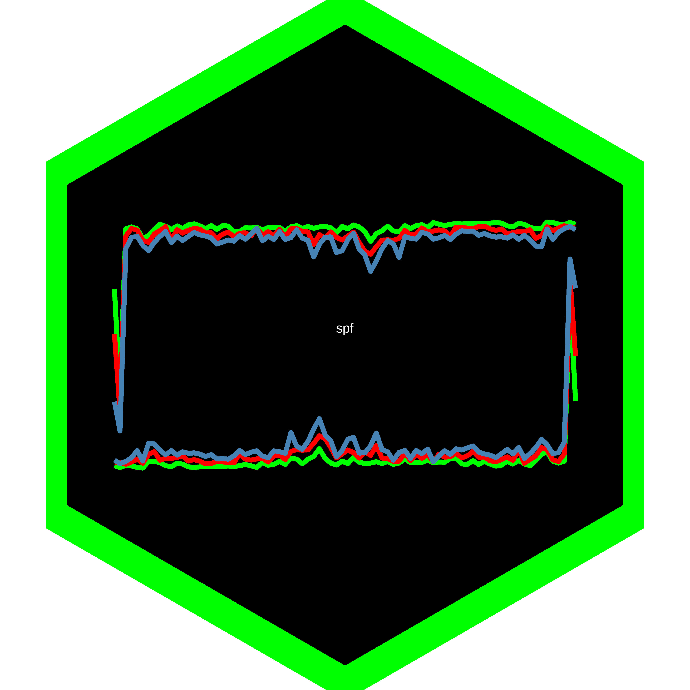

<!-- README.md is generated from README.Rmd. Please edit that file -->

spf <a href='https://github.com/markushhh/spf'></a>
=====================================================================================================================

<!-- badges: start -->
<!-- badges: end -->

`spf` offers the possibility to download data from the S[urvey of
Professional
Forecasters](https://www.philadelphiafed.org/research-and-data/real-time-center/survey-of-professional-forecasters/data-files)
(SPF) provided by the Federal Reserve Bank of Philadelphia.

Installation
------------

``` r
devtools::install_github("markushhh/spf")
```

Examples
--------

``` r
get_individual("EMP")
get_mean("RGDP", type = "level")
get_mean("RGDP", type = "growth")
get_mean("RGDP", type = "pct")
get_mean("EMP", type = "level")
get_mean("EMP", type = "pct")
get_mean("EMP", type = "ave")
get_median("EMP", type = "level")
get_median("EMP", type = "pct")
get_median("EMP", type = "ave")
get_dispersion("EMP")
```

Code of Conduct
---------------

Please note that the spf project is released with a [Contributor Code of
Conduct](https://contributor-covenant.org/version/2/0/CODE_OF_CONDUCT.html).
By contributing to this project, you agree to abide by its terms.
