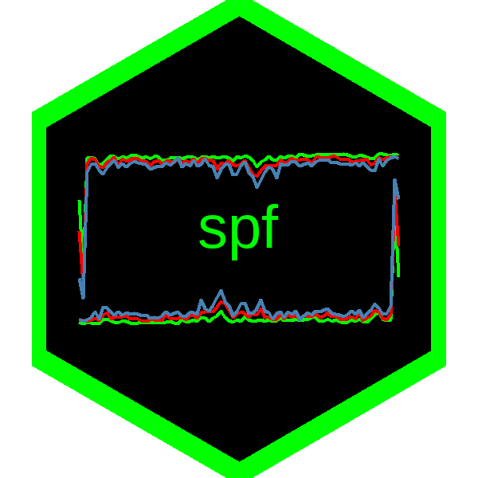

<!-- README.md is generated from README.Rmd. Please edit that file -->

spf <a href='https://github.com/markushhh/spf'></a>
=====================================================================================================================

<!-- badges: start -->
<!-- badges: end -->

`spf` offers the possibility to download data from the [Survey of
Professional
Forecasters](https://www.philadelphiafed.org/research-and-data/real-time-center/survey-of-professional-forecasters/data-files)
(SPF) provided by the Federal Reserve Bank of Philadelphia.

Installation
------------

``` r
devtools::install_github("markushhh/spf")
```

Examples
--------

``` r
df <- get_mean("NGDP", type = "level")
tail(df)
#>     YEARQUARTER   NGDP1    NGDP2    NGDP3    NGDP4    NGDP5    NGDP6    NGDPA    NGDPB
#> 203     2019 Q2 21062.7 21276.98 21499.56 21723.42 21937.65 22159.90 21391.45 22254.96
#> 204     2019 Q3 21337.9 21538.67 21754.36 21964.99 22175.29 22388.01 21432.86 22277.63
#> 205     2019 Q4 21525.8 21721.77 21924.05 22145.50 22352.62 22565.83 21422.28 22248.00
#> 206     2020 Q1 21734.3 21924.78 22147.09 22370.61 22600.61 22828.48 22261.47 23166.72
#> 207     2020 Q2 21537.9 19596.36 20125.76 20504.92 20841.64 21162.05 20449.87 21310.22
#> 208     2020 Q3 19408.8 20376.39 20720.11 21023.38 21280.60 21565.19 20514.53 21461.45
```

``` r
df <- get_individual("NGDP")
tail(df)
#>      YEARQUARTER  ID INDUSTRY    NGDP1    NGDP2    NGDP3    NGDP4    NGDP5    NGDP6 NGDPA NGDPB
#> 8417     2020 Q3 579        1 19408.80 20384.98 20497.41 20597.55 20683.54 21126.87     1     1
#> 8418     2020 Q3 584        1 19408.80 20270.04 20700.32 21014.24 21244.12 21420.96     1     1
#> 8419     2020 Q3 585        1 19408.80 20631.68 21027.44 21460.19 21694.82 21804.55     1     1
#> 8420     2020 Q3 586        1 19408.80 19982.60 20348.20 20562.50 20786.30 21011.50     1     1
#> 8421     2020 Q3 587        1 19408.76 20232.56 20732.60 21055.35 21347.27 21608.73     1     1
#> 8422     2020 Q3 588        1 19408.80 20751.67 21359.02 21675.20 21996.78 22282.54     1     1
```

``` r
library("ggplot2")

df %>%
  dispersion(f = mean) %>% 
  ggplot() +
  geom_line(aes(YEARQUARTER, NGDP1), col = "steelblue")
```


``` r
df <- get_mean("RGDP", type = "level")
df <- get_mean("RGDP", type = "growth")
df <- get_mean("RGDP", type = "pct")
df <- get_mean("EMP", type = "level")
df <- get_mean("EMP", type = "pct")
df <- get_mean("EMP", type = "ave")
df <- get_median("EMP", type = "level")
df <- get_median("EMP", type = "pct")
df <- get_median("EMP", type = "ave")
df <- get_dispersion("EMP")
df <- get_anxious_index()
df <- get_inflation()
df <- get_additional_cpie10()
get_microdata(file = "SPFmicrodata.xlsx") # download and writes "SPFmicrodata.xlsx" to the disk
get_prob(file = "prob.xlsx") # download and writes "prob.xlsx" to the disk
```

The
[documentation](https://www.philadelphiafed.org/-/media/research-and-data/real-time-center/survey-of-professional-forecasters/spf-documentation.pdf?la=en)
is really helpful.

Survey of Professional Forecasters in Europe (ECB)
--------------------------------------------------

For the survey of professional forecasters in Europe, visit the [ECB’s
Data Warehouse](https://sdw.ecb.europa.eu/browse.do?node=9691152) The R
package [ecb](https://github.com/expersso/ecb) may be useful.

Code of Conduct
---------------

Please note that the spf project is released with a [Contributor Code of
Conduct](https://contributor-covenant.org/version/2/0/CODE_OF_CONDUCT.html).
By contributing to this project, you agree to abide by its terms.

Disclaimer
----------

This package is in no way officially related to, or endorsed by, the
Federal Reserve Bank of Philadelphia nor the European Central Bank.
